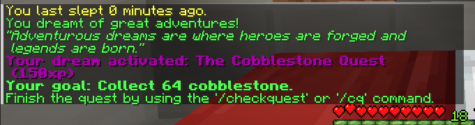

# RealisticDreams
 **RealisticDreams** is an immersive Minecraft plugin that changes the sleeping experience. Players can embark on dreamy adventures, face nightmares, and even earn positive/negative buffs based on their dreams. Start your day with one of over 100 motivational quotes randomly selected based on 9 distinct types of dreams. Additionally, players can engage in daily quests for adventurous dreams, earning extra experience points along the way. Get ready to explore the realm of dreams like never before!

## Functionality

- **Dreaming Mechanics**: When sleeping in the game, players can experience various types of dreams, including good dreams, adventurous dreams, weird dreams, nightmares, existential dreams, romantic dreams, family dreams, dreams related to sleep disorders, or dreams of flying.  Each dream type affects your character in unique ways when you wake up.
- **Dream Buffs** and Debuffs: Depending on the dream, receive beneficial buffs or detrimental debuffs to start your Minecraft day.
- **Daily Quests**: If a player experiences an adventurous dream, they are offered a daily quest. Failure to complete the quest before the next sleep will result in automatic failure.
- **Motivational Quotes**: Wake up to one of over 100 inspirational quotes based on the type of dream experienced.
- **Sleep Tracker**: Players can check the time elapsed since their last sleep.
- **Customization**: The plugin allows for easy customization of dream properties, quotes, quest items, and the ability to disable the sleep tracker. See the [Configuration](#configuration) section for more details.
- **Permissions**: Set permissions for using plugin commands. See the [Permissions](#permissions) section for more details.

## Installation

1. Download the RealisticDreams plugin JAR file.
2. Place the JAR file in the "plugins" folder of your Minecraft server directory.
3. Restart or reload your server.
4. RealisticDreams is now ready to use!

## Commands

- `/lastslept` or `/ls`: Check the time elapsed since the last sleep.
- `/checkquest` or `/cq`: Check the progress of and complete daily quests.

## Permissions
Permissions for using plugin commands are set by default for all players on the server.
- `realisticdreams.checkquest`: Allows players to check the progress of and complete daily quests.
- `realisticdreams.lastslept`: Allows players to check the time elapsed since the last sleep.

## Configuration

To customize dream properties, quotes, quest items, or to disable the sleep tracker, navigate to the `config.yml` file located in `plugins/RealisticDreams/`.

Example of the `config.yml` file:
```yaml
Dreams:
  Category:
    GOOD:
      QuotesGroup: goodQuotes
      Message: "You had a pleasant dream."
      Type: GOOD
      Effect: HEAL
      Duration: LONG
      Intensity: LOW
      ...
```
In the `Dreams` section, you can customize the properties of each dream category. The `QuotesGroup` property refers to the group of quotes that will be displayed when a player experiences a dream of that category. The `Message` property is the message that will be displayed when a player experiences a dream of that category. The `Type` property refers to the type of dream, and the `Effect` property refers to the effect that will be applied to the player when they wake up. The `Duration` property refers to the duration of the effect, and the `Intensity` property refers to the intensity of the effect.

The durations are predefined as:
- `QUICK`: 1 second
- `SHORT`: 10 seconds
- `MEDIUM`: 20 seconds
- `LONG`: 1 minute

While the intensities are predefined as:
- `LOW`: 1
- `MEDIUM`: 2
- `HIGH`: 3

## Feedback and Support

If you encounter any issues or have suggestions for improving RealisticDreams, feel free to reach out to me or post on the plugin's official page. I am always open to feedback and will do my best to address any concerns or questions you may have. Due to lack of time however, feel free to contribute to the plugin by submitting a pull request. 

Enjoy your journey through the world of dreams with RealisticDreams!

## Screenshots
 
 
 
 
